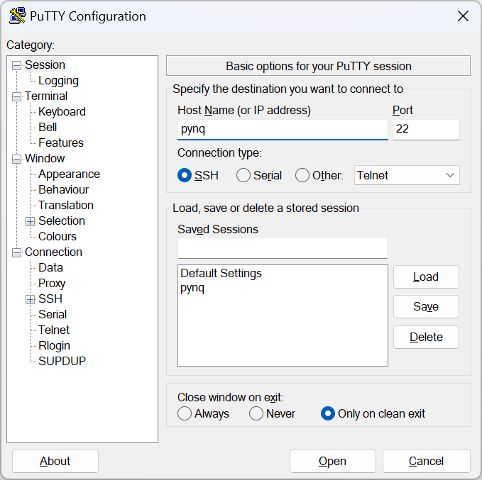
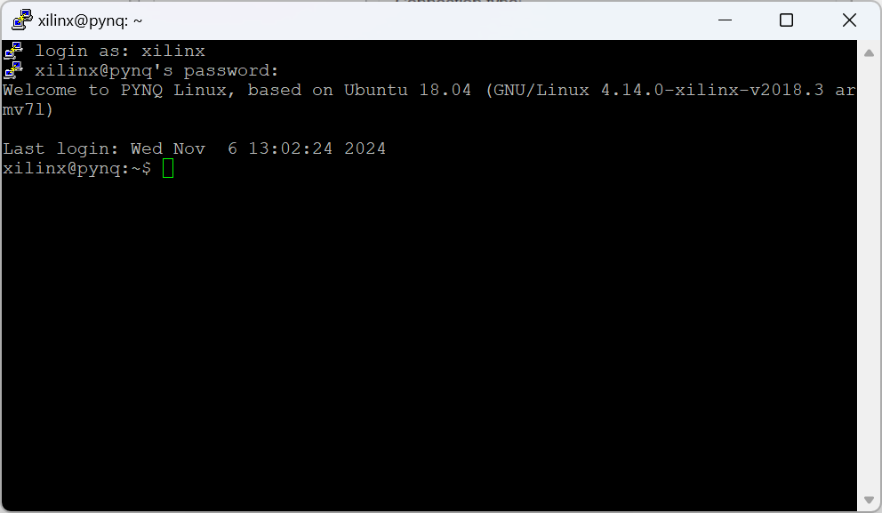
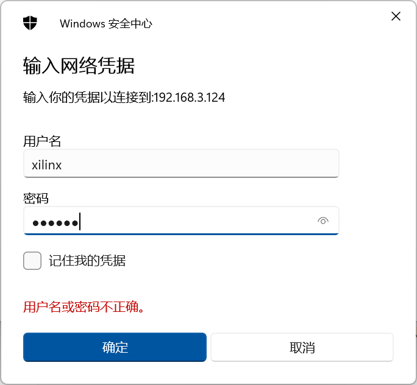
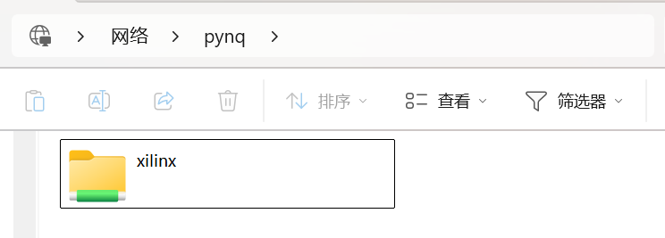

# VLF接收机使用说明

## 1 准备工作

### 1.1 天线以及电源连接

接收机外壳上的品字插座需要接到**12V**电源上，注意是**12V**，不是**220V**

将两路磁天线和北斗的天线接至机箱相应的SMA接口，机箱USB口接外置的硬盘柜，注意硬盘盒也需要**12V**供电

### 1.2 网络连接


## 2 通过SSH连接

打开**Putty**，使用**SSH**进行连接，**Host Name**填写**pynq**，如图所示：



可以通过**Save**将设置保存下来，以后只需要双击**Default Settings**里的**pynq**就行

点击**Open**，会出现接收机的命令行窗口，需要登录使用，用户名和密码均为` xilinx `，这里输入密码的时候不会显示，输入完成后回车即可



这样就进入了接收机的系统里面，之后可以使用命令行工具来对系统进行操作


## 3 通过Samba实现文件共享

接收机上运行了Samba文件共享服务，允许从网络访问PYNQ的主区域，便于和接收机之间的文件传输

如图所示，在Windows的文件资源管理器顶部的地址栏中输入Host Name：

``` shell
\\pynq
```

用户名和密码都是xilinx，可以选择`记住我的凭据`，以后就不用每次登入都输入用户名和密码



点击确定，现在就可以直接访问PYNQ的主文件夹了，可以像访问本机的文件夹一样，对文件进行查看、拷贝等操作

例如数据存放在`disk`文件夹中，可以直接从中进行复制


## 4 数据存储

### 4.1 数据存储格式


## 5 常用操作

主要是使用Putty的时候会用到的一些操作

### 5.1 磁盘挂载


### 5.2 Supervisor进程管理

接收机使用Supervisor来实现开机自启动以及进程的管理，要查看当前进程状态，使用指令

``` bash
xilinx@pynq:~$ sudo supervisorctl status
daq                              RUNNING   pid 1819, uptime 17:34:07
```

daq就是我们正在执行的数据采集进程，要想关闭进程，可以使用指令

``` bash
xilinx@pynq:~$ sudo supervisorctl stop daq
daq: stopped
xilinx@pynq:~$ sudo supervisorctl status
daq                              STOPPED   Nov 07 06:37 AM
```

再启动daq，可以使用指令

``` bash
xilinx@pynq:~$ sudo supervisorctl start daq
daq: started
```

