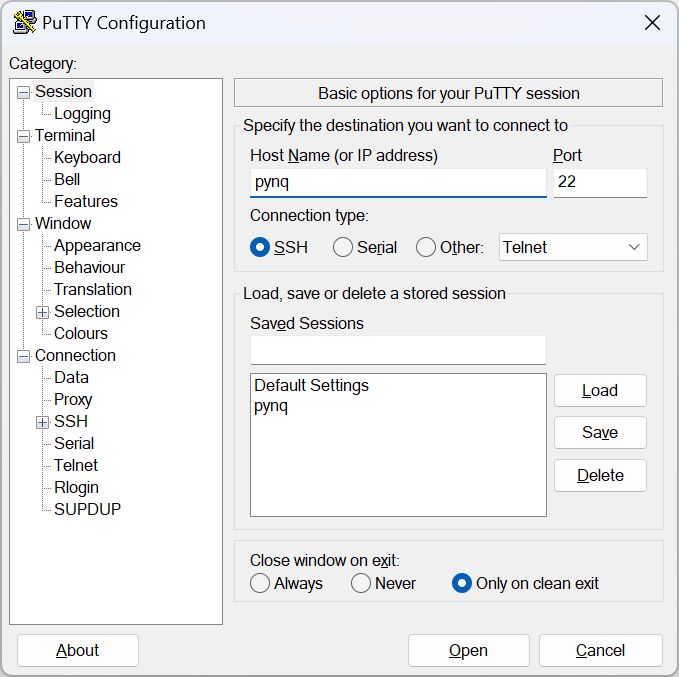
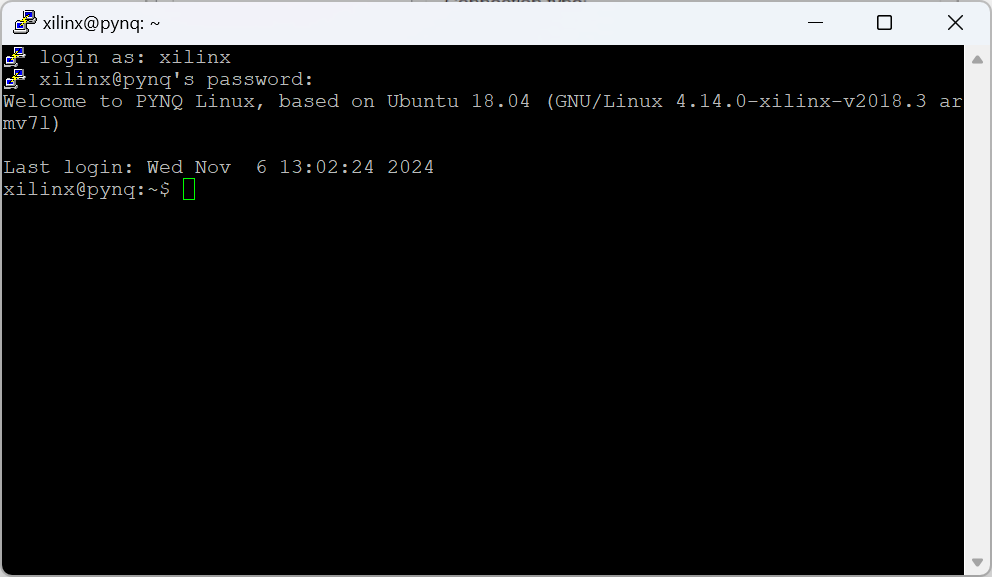
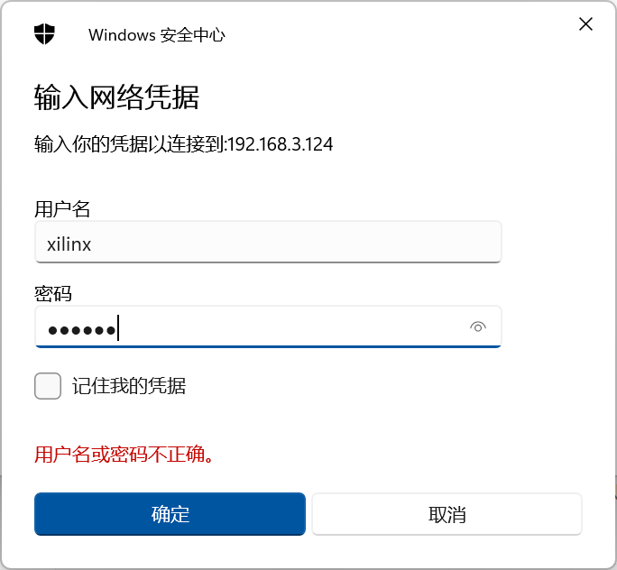
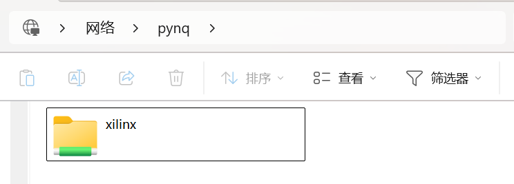
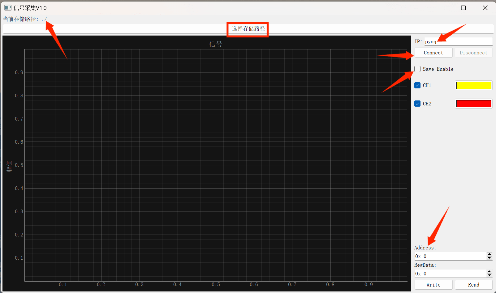

# VLF接收机使用说明

## 1 准备工作

### 1.1 天线以及电源连接

接收机外壳上的品字插座需要接到**12V**电源上，注意是**12V**，不是**220V**

将两路磁天线和北斗天线接至机箱相应的SMA接口，机箱USB口接外置的硬盘柜，注意硬盘盒也需要**12V**供电

### 1.2 网络连接

确保设备与电脑处于同一网段，可以是设备接到路由器上，电脑通过有线或者无线的方式连接至该网络，这时的设备是联网了的（可以访问外网，时间等信息也会自动进行同步），也可以选择将设备直接接到电脑的网口，此时设备没有与外部的网络连接，但是可以与本地电脑进行网络传输

确保硬件连接好后，可以在本地主机上ping一下pynq，如果能ping通，说明网络连接没有问题，PYNQ正常启动

``` shell
PS C:\Users\43601> ping pynq
///////////////////add here
```

可以看到pynq的ip地址为

``` shell
```


#### 1.2.1 常见网络问题的解决办法


## 2 通过SSH连接

打开**Putty**，使用**SSH**进行连接，**Host Name**填写**pynq**，如图所示：



可以通过**Save**将设置保存下来，以后只需要双击**Default Settings**里的**pynq**就行

点击**Open**，会出现接收机的命令行窗口，需要登录使用，用户名和密码均为` xilinx `，这里输入密码的时候不会显示，输入完成后回车即可



这样就登入了接收机的系统，之后可以使用命令行工具来对系统进行操作


## 3 通过Samba实现文件共享

接收机上运行了Samba文件共享服务，允许从网络访问PYNQ的主区域，便于和接收机之间的文件传输

如图所示，在Windows的文件资源管理器顶部的地址栏中输入Host Name：

``` shell
\\pynq
```

用户名和密码都是xilinx，可以选择`记住我的凭据`，以后就不用每次登入都输入用户名和密码



点击确定，现在就可以直接访问PYNQ的主文件夹了，可以像访问本机的文件夹一样，对远程的文件进行查看、拷贝等操作

例如数据存放在`disk`文件夹中，可以直接从中进行复制


## 4 数据存储

### 4.1 上位机软件的使用

双击打开上位机软件



上方可以选择数据的存储路径，默认路径为当前文件夹下

右侧是对应设备的IP，电脑支持Host Name的话可以使用**pynq**进行连接

点击`connect`即可连接，`Disconnect`断开连接

勾选`Save Enable`可以存储数据

连接之后，中间的坐标框会显示出当前接收到的波形，右侧的`CH1`、`CH2`可以勾选是否显示，以及改变显示的颜色

#### 4.1.1 寄存器配置

界面底部可以查看当前配置的寄存器的数值，也可以通过修改寄存器的值来实现下采样、控制增益等功能

| 地址 | 功能         | 值                                                      |
| ---- | ------------ | ------------------------------------------------------- |
| 0x14 | 配置前级增益 | 以0x6000600为例，高三位与第三位分别表示两个通道的控制字 |
| 0x18 | 下采样       | 以0x02为例，///////////////////////                     |


### 4.2 数据存储格式

可以按照uint16将数据读出来

数据存储格式为：

|              |           帧头           |      GPS数据长度       |                           GPS数据                            |                           ADC数据                            |
| ------------ | :----------------------: | :--------------------: | :----------------------------------------------------------: | :----------------------------------------------------------: |
| **数据长度** |           2位            |          2位           |                            2*N位                             |                                                              |
| **数据内容** |       0x55AA_A810        |          N-0           | N<sub>1</sub>-0, N<sub>2</sub>-0, N<sub>3</sub>-0, ... ,N<sub>N</sub>-0 | A<sub>1</sub>-B<sub>1</sub>, A<sub>2</sub>-B<sub>2</sub>, A<sub>3</sub>-B<sub>3</sub>, ... |
| **注释**     | 对应十进制的21930和43024 | 第一位长度，第二位补零 |                    第一位数据，第二位补零                    |                   第一位A路，第二位B路 ...                   |

### 4.3 数据读取参考代码

``` matlab
fid = fopen('GPS_20241107_182833.bin','r');
data = fread(fid,'uint16');
gps_length = data(3);
header_length = gps_length * 2 + 4;
gps_data = data(5:2:header_length);
ch1 = data(header_length + 1:2:end);
ch2 = data(header_length + 2:2:end);
```

上面默认存下来的都是正确的数据，实际使用的时候可以校验下帧头等


## 5 常用操作

主要是使用Putty的时候会用到的一些操作

### 5.1 磁盘挂载

首先在未接硬盘之前，用fdisk -l指令查看一下当前设备的硬盘情况

``` bash
fdisk -l
```

接上硬盘之后，再fdisk -l查看一下

``` bash
```

这个/dev/sda1就是接上去的磁盘

接着，如果是新磁盘，需要先格式化一下，使用指令

``` bash
mkfs.ext4 /dev/sda1
```


### 5.2 Supervisor进程管理

接收机使用Supervisor来实现开机自启动以及进程的管理，要查看当前进程状态，使用指令

``` bash
xilinx@pynq:~$ sudo supervisorctl status
daq                              RUNNING   pid 1819, uptime 17:34:07
```

daq就是我们正在执行的数据采集进程，要想关闭进程，可以使用指令

``` bash
xilinx@pynq:~$ sudo supervisorctl stop daq
daq: stopped
xilinx@pynq:~$ sudo supervisorctl status
daq                              STOPPED   Nov 07 06:37 AM
```

再启动daq，可以使用指令

``` bash
xilinx@pynq:~$ sudo supervisorctl start daq
daq: started
```

