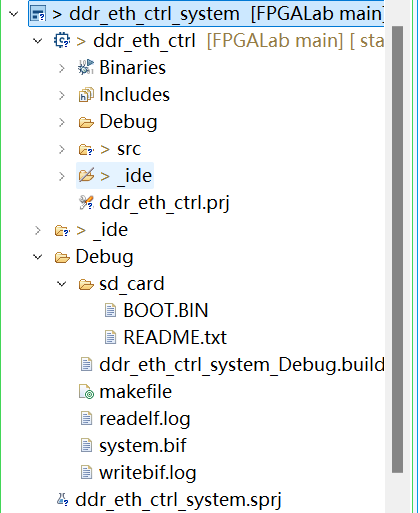
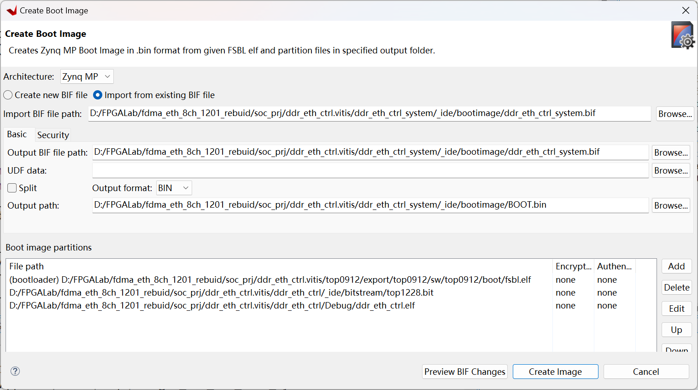
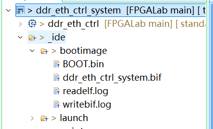
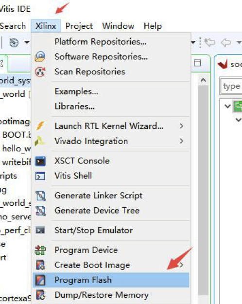
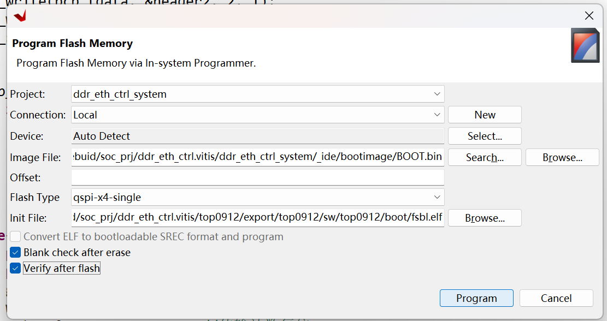

# FPGA笔记

## 1 带有PS的固化

ZYNQ中，PS作为主器件，PL作为PS的一个外设，需要由PS配置PL。

只需要正确产生BOOT.BIN文件，正确设置模式开关，掌握烧录流程即可。

## 1.1 BOOT.BIN的产生方法

### 1.1.1 第一种方法

首先build project

找到debug底下的sd_card文件夹，里面有BOOT.BIN

``` bash
D:\FPGALab\fdma_eth_8ch_1201_rebuid\soc_prj\ddr_eth_ctrl.vitis\ddr_eth_ctrl_system\Debug\sd_card\BOOT.bin
```




### 1.1.2 第二种方法

右击需要制作BOOT.BIN文件的APP工程，点击Create Boot Image，一般会自动添加三个文件，顺序必须是fsbl.elf，top.bit，ddr_eth_ctrl.elf，点击Create Image即可，生成的文件在_ide文件夹下的bootimage文件夹里

``` bash
D:\FPGALab\fdma_eth_8ch_1201_rebuid\soc_prj\ddr_eth_ctrl.vitis\ddr_eth_ctrl_system\_ide\bootimage\BOOT.bin
```






## 1.2 启动方法

### 1.2.1 SD卡启动

直接复制路径下的BOOT.bin文件并且放到SD卡中，之后插入板卡，安装时处于断电状态；

将启动方式拨到SD卡启动；

### 1.2.2 QSPI启动

在Xilinx下的Program Flash





点击Program进行烧录，完成后断电，设置模式开关为QSPI启动（米联客3EG的为010）

上电，程序正常启动